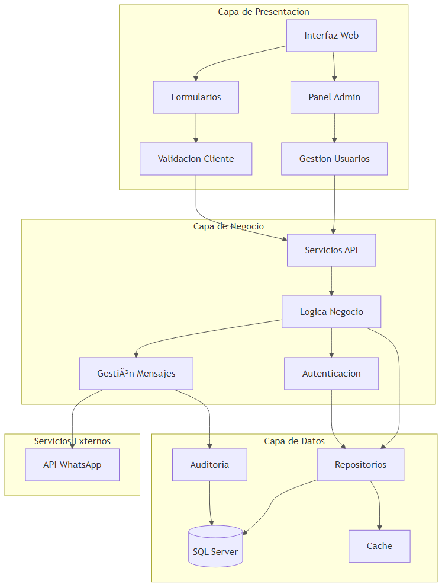

# Arquitectura General

## Visión General

El sistema está desarrollado siguiendo una arquitectura de capas que separa la interfaz de usuario, la lógica de negocio y el acceso a datos:

## Principios de Diseño

La arquitectura del sistema se basa en los siguientes principios de diseño:

1. **Separación de Responsabilidades**: Cada componente del sistema tiene una responsabilidad única y bien definida.
2. **Independencia de Capas**: Las capas superiores dependen de las inferiores, pero no al revés.
3. **Abstracción de Datos**: El acceso a datos está abstraído mediante interfaces y patrones de repositorio.
4. **Seguridad por Diseño**: La seguridad está integrada en todas las capas de la aplicación.

## Flujo de Datos

El flujo de información se gestiona de forma segura siguiendo estos pasos:

1. La interfaz de usuario captura datos de entrada del usuario
2. Los controladores procesan las solicitudes y aplican reglas de negocio
3. Los datos se almacenan en SQL Server mediante procedimientos almacenados
4. Las notificaciones se generan y envían a los clientes a través de la API de WhatsApp
5. Todas las operaciones se registran en el sistema de auditoría

## Patrones de Diseño Implementados

El sistema implementa varios patrones de diseño para mejorar la mantenibilidad y escalabilidad:

- **Patrón Repositorio**: Para abstraer el acceso a datos
- **Patrón Observador**: Para gestionar eventos y notificaciones
- **Patrón Fachada**: Para simplificar la interfaz con subsistemas complejos
- **Patrón Estrategia**: Para permitir diferentes algoritmos de procesamiento
- **Inyección de Dependencias**: Para desacoplar componentes y facilitar pruebas

Para más detalles sobre los componentes específicos del sistema, consulte [Componentes del Sistema](./componentes.md).

Para información sobre la configuración, vea [Configuración de Base de Datos](../configuracion/base_datos.md) y [Integración con WhatsApp](../configuracion/whatsapp.md).

# Arquitectura del Sistema

## Visión General

El sistema está desarrollado siguiendo una arquitectura de capas que separa la interfaz de usuario, la lógica de negocio y el acceso a datos:

## Flujo de Datos

El flujo de información se gestiona de forma segura siguiendo estos pasos:

1. La interfaz de usuario captura datos de entrada del usuario
2. Los controladores procesan las solicitudes y aplican reglas de negocio
3. Los datos se almacenan en SQL Server mediante procedimientos almacenados
4. Las notificaciones se generan y envían a los clientes a través de la API de WhatsApp
5. Todas las operaciones se registran en el sistema de auditoría

## Introducción General

Este sistema es una aplicación desarrollada para administrar información de clientes con integración a SQL Server y capacidades de comunicación a través de WhatsApp. Esta documentación está dirigida a desarrolladores, administradores de sistemas y personal técnico responsable de la implementación, mantenimiento y mejora del sistema.

