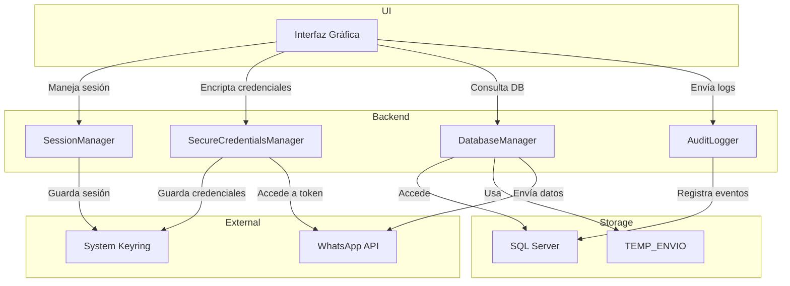

# Arquitectura del Sistema

## Diagrama de Componentes

    
```   
> **Nota Técnica**: El sistema usa _connection pooling_ para manejar hasta 50 solicitudes 
concurrentes a la base de datos, optimizando el uso de recursos durante operaciones masivas.
```