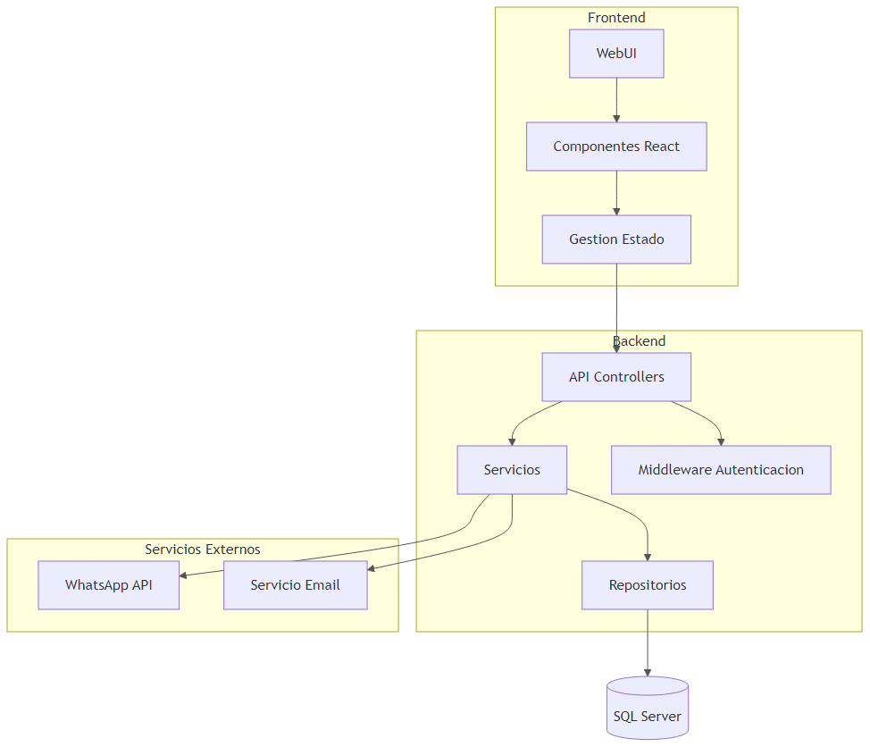
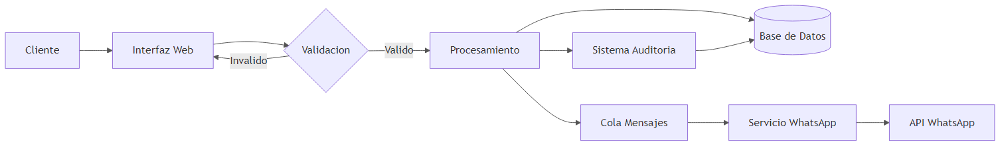
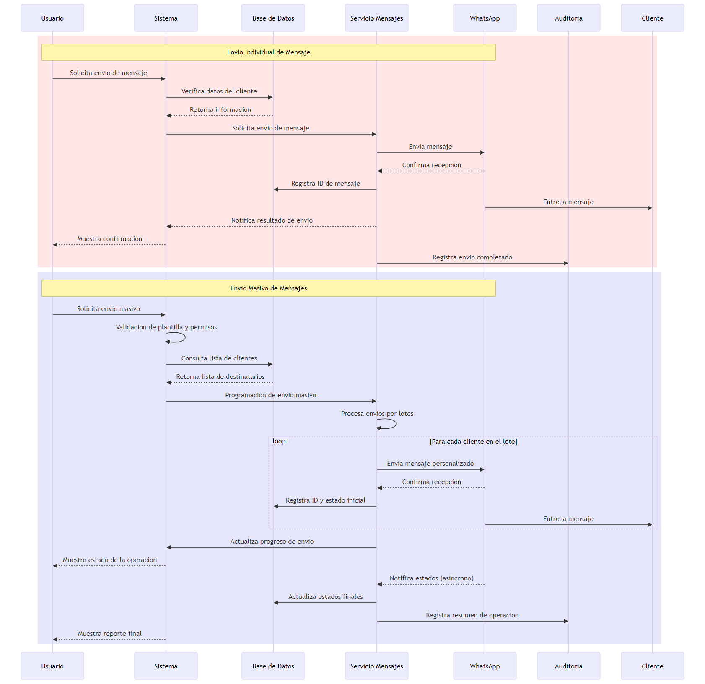
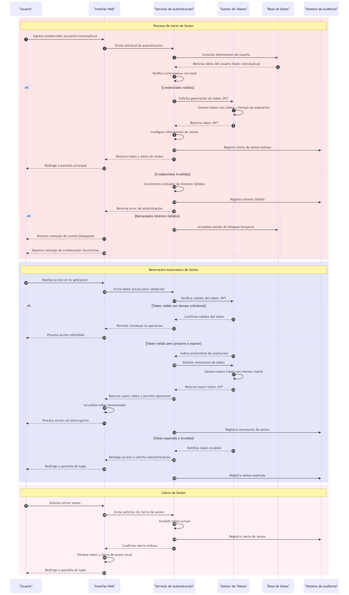

# Diagramas Técnicos del Sistema

## Introducción

Este documento proporciona una guía completa de los diagramas técnicos utilizados en la documentación del sistema. Cada diagrama ha sido diseñado para ilustrar aspectos específicos de la arquitectura y funcionamiento del sistema.

## Diagramas Disponibles

### 1. Arquitectura General

Este diagrama muestra la arquitectura de tres capas del sistema, incluyendo:
- Capa de Presentación
- Capa de Negocio
- Capa de Datos
- Servicios Externos

### 2. Componentes del Sistema

Ilustra la interrelación entre los diferentes componentes del sistema, mostrando:
- Módulos principales
- Dependencias entre componentes
- Interfaces externas
- Flujos de comunicación

### 3. Flujo de Datos

Representa el flujo de información a través del sistema:
- Entrada de datos
- Procesamiento
- Almacenamiento
- Comunicación entre componentes

### 4. Proceso de Mensajería

Detalla el proceso de envío de mensajes:
- Envío individual de mensajes
- Proceso de envío masivo
- Confirmaciones y estados
- Registro de auditoría

### 5. Autenticación y Sesiones

Muestra el proceso completo de autenticación:
- Inicio de sesión
- Validación de credenciales
- Manejo de sesiones
- Renovación automática
- Cierre de sesión

## Mantenimiento de Diagramas

Los diagramas se mantienen en formato Mermaid para facilitar su actualización:

1. Los archivos fuente se encuentran en la carpeta `/recursos` con extensión .txt
2. Las imágenes PNG generadas se almacenan en la misma carpeta
3. Para actualizar un diagrama, siga las instrucciones en [INSTRUCCIONES_CONVERSION.md](../recursos/INSTRUCCIONES_CONVERSION.md)

## Referencias

- [Arquitectura General](arquitectura/general.md)
- [Componentes del Sistema](arquitectura/componentes.md)
- [Configuración de WhatsApp](configuracion/whatsapp.md)
- [Gestión de Sesiones](sistema/sesiones.md)

## Notas de Actualización

Al actualizar los diagramas:
1. Mantener la consistencia en el estilo y nomenclatura
2. Actualizar la documentación relacionada si es necesario
3. Verificar que las referencias en otros documentos sean correctas
4. Mantener copias de respaldo de los archivos fuente
