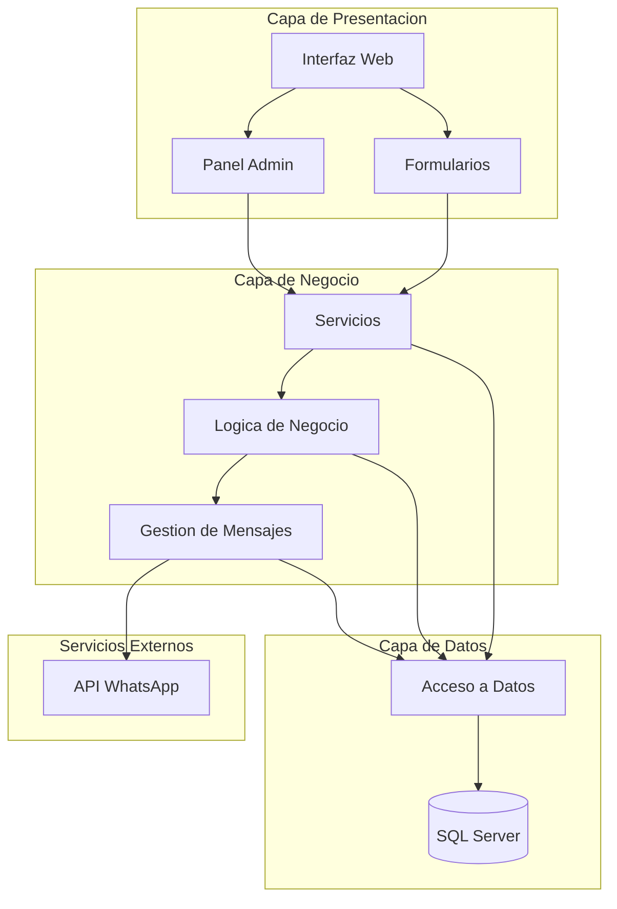
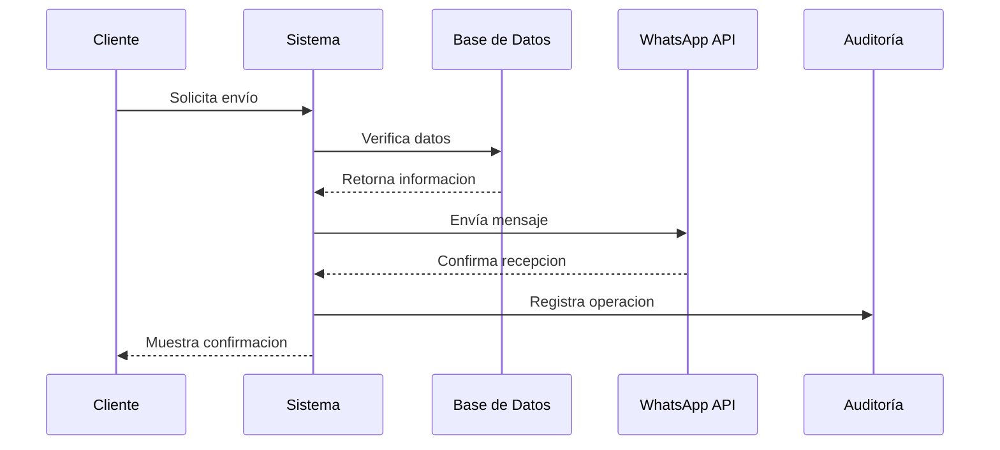

# Ejemplos de Diagramas Renderizados

A continuacion se muestran ejemplos de como deberían verse los diagramas después de ser renderizados a PNG utilizando Mermaid.

## Arquitectura del Sistema

## Flujo de Mensajes

Los diagramas reales deben ser convertidos a PNG siguiendo las instrucciones en [nota_conversion.md](nota_conversion.md) y luego referenciados en la documentación.

